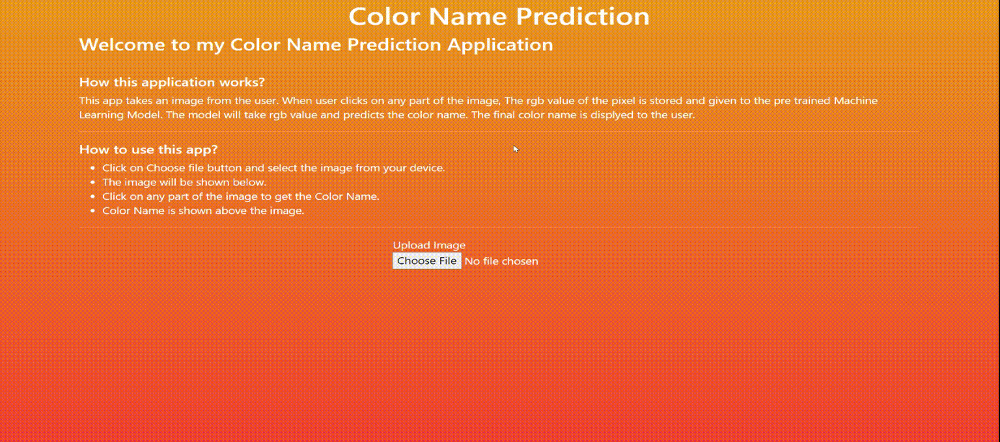

# Color Name Prediction

**Color Name Prediction** is a web application that predicts the name of a color when a user clicks on an image. It uses a K-Nearest Neighbors (KNN) algorithm to find the nearest color name based on the RGB value. The dataset contains a diverse set of approximately 865 color names.

## Demo

## Features

- Click on an image to sample the color.
- The application predicts the color's name based on its RGB value.
- Utilizes a K-Nearest Neighbors algorithm for color name prediction.
- Provides color naming for approximately 865 different shades.
- Offers an interactive and user-friendly interface.

You can experience the application in action by watching the [live demo](https://lakshmankishore.github.io/colorNamePrediction/).
